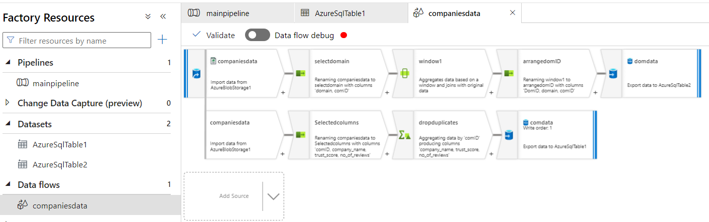

# Supply Chain Customer Satisfaction Sentiment Analysis

Building complete data pipeline as well as sentiment analysis using NLP model on azure cloud services 

## Introduction

The "Supply Chain Customer Satisfaction on Azure" project focuses on analyzing customer satisfaction within the energy companies' supply chain using natural language processing (NLP) models. The aim of this project is to predict customers' sentiments – whether they are happy, sad, or just satisfied – based on their feedback and interactions with the supply chain processes.

The primary data source for this project is Trustpilot (https://www.trustpilot.com), a leading online review platform where customers share their experiences and opinions about various businesses, including energy companies. Trustpilot provides a rich repository of customer feedback, including text-based reviews and ratings, which serve as valuable inputs for sentiment analysis and predictive modeling.

By leveraging Trustpilot data and Azure services, this project aims to provide insights into customer satisfaction levels across different aspects of the energy companies' supply chain. Through advanced analytics and machine learning techniques, we seek to identify patterns, trends, and sentiment indicators that can inform strategic decision-making and improve overall customer satisfaction.

## Installation

1. Azure VM: to add the webscrapping code 
2. Azure blob Storage so that the raw data are stored
3. Azure Data Factory to build ETL Pipelines 
4. Azure Databricks to process the data USING Apache Spark 
5. Azure SQL database containing the tables

## Steps

1. After setting up Azure VM, copy the supply chain directory to the VM, which uses UBUNTU as operating system. 
2. Create in the directory a config.json file containing the container_connection_string and container name from the blob storage instance. As we as create a container called compananies in blob storage 
3. RUN ´run_project.sh´. 
4. Once done, you will notince 4 files crated in the container, companies_data.csv , example of 4 companies reviews_data
5. From azure datafactory create a pipeline with the following setup as descripted in the photo (note: details of connection and processing can vary upon purpose). 

    

6. From the Data Factory create data flow as shown in the pic, and create a data pipeline containing this data flow object 
Guidance on how to use your project, including examples, command-line options, or GUI instructions.

## Resuls

1. The main companies data are stored in a db contaning, the columns such as company ID, Name, Overall_score, Number of reviews. 
2. Another table is created named domain (DomID is a foreign_key) in companies main data table. 

3. to be added. 
